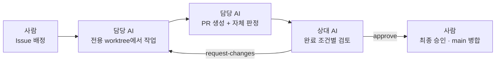

# COLLABORATION — 사람 1명 + AI 2개로 일하는 방법

> 이 저장소는 **사람 1명이 AI 2개(Claude · Codex)를 운영하는 체제**로 만든다.
> AI를 어떻게 쓸 것인가 자체를 설계 대상으로 두고, 문제가 드러날 때마다 방식을 고쳤다.
> 이 문서는 그 결과와 **왜 그렇게 정했는지**, 그리고 **지금 어디까지 왔는지**를 담는다.

---

## 0. 진행 상황

> **새 세션을 시작하는 사람·AI는 여기부터 읽는다.** 지난 경위가 아니라 **앞으로 계속 참고할 것**만 적는다.
> 갱신 2026-07-28

### 확정 — 되돌리지 않는다

| 항목 | 내용 |
|---|---|
| **Agent 정의** | 식자재 조달 **점검 우선순위**를 정하는 Agent. *결정을 대신하지 않고 무엇을 먼저 볼지 정한다* |
| **사용자** | 기업의 **구매·조달 담당자** |
| **데이터** | 공공데이터포털 API **13종** ([DATA_SOURCES.md](DATA_SOURCES.md)) · 전부 `serviceKey` 하나 |
| **지원 품목** | **A그룹 61종**(산지·도매·소매 3단계) · **B그룹 32종**(산지·도매 2단계) ([DATA_CRITERIA §4](DATA_CRITERIA.md)) |
| **산출물** | 예외 보고 한 장 — 우선 검토 품목 → 근거 → 영향 → 대응 → **추가 확인 사항** → 시한 참고 |
| **층 구조** | 0층 입력 없음 · 1층 품목 목록 · 2층 매입가(범위 밖) |

### 실측으로 확인된 것 — 다시 재지 않는다

- 🔑 **유통 결합은 두 구간이 다르다.** **산지 ↔ 도매**는 `gds_*` 코드가 같아 그대로 이어지고(대분류 8개 일치, 불일치 0), **도매 ↔ 소매**는 `perDay`가 다른 체계(`ctgry_cd`·`item_cd`)라 **대응표가 필요하다**. 61종만 대응 완료 ([DATA_CRITERIA §3](DATA_CRITERIA.md))
- **등락률·통계가 API에 있다.** 전일·전주·전월·전년 등락률, 월별 표준편차·변동계수
- **기상 30일 누적 지표로는 가격 급등을 설명하지 못한다** — 대조군이 더 나빴다 ([DATA_CRITERIA §6](DATA_CRITERIA.md))
- **품질** — 배추 3년 48,240건에서 핵심 컬럼 결측 0 · 중복 키 0 · 커버리지 92.7~94.2%(나머지는 공휴일)

### Timely 플랫폼 제약 — 설계가 여기 묶인다

| 되는 것 | 안 되는 것 |
|---|---|
| `bash` + Python/curl로 **외부 API 자유 호출** | 🔴 **HTML 폼·체크박스 입력 회수** — iframe 샌드박스라 출구가 없다 |
| `schedule` frontmatter로 **cron 실행** (최소 1시간, Asia/Seoul) | |
| `read`/`write`/`edit`로 **파일 I/O** (워크스페이스 ↔ 클라우드 자동 sync) | |
| `create_artifact`로 **HTML 인라인 렌더링** (차트·대시보드) | |
| `create_spreadsheet`로 **편집 그리드 → 결과를 파일로 회수** | |
| `update_plan`으로 **진행 체크리스트 표시** · `ask_user_form`으로 선택 받기 | |

> **사용자 입력은 `ask_user_form` · `create_spreadsheet` · 대화 셋 중 하나로 받는다.** HTML 폼은 표시만 가능하다.
> 인증키는 **환경변수(`request_env_var`)** 로 받는다 — 저장소에 두지 않는다는 규칙과 일치.

### 미확정 — 다음에 정할 것

| 순서 | 결정 | 왜 그 순서인가 |
|---:|---|---|
| 1 | 🔴 **기준가 정의** | *"평소"*를 무엇으로 잡나 — 평년 동월 · 직전 N일 · 등급별 분포. **이것 없이는 「평소와 다름」을 정의할 수 없다** |
| 2 | **「이상」 판정 기준** | 기준가 대비 무엇을 임계로. `yy1_bfr_cmpr_rafrt`(전년 대비)냐 변동계수 배수냐. **임의 임계치를 쓰지 않는 방법**이어야 한다 |
| 3 | **심화 조사 분기 규칙** | 어떤 관측에서 어느 도구를 쓸지. Agent다움이 여기서 갈린다 |
| 4 | **수집 범위 최종** | 품목 수 × 기간 × 갱신 주기. 일 트래픽 10,000 안에 |
| 5 | Skill 입출력 계약 | 위 넷이 정해져야 필드가 잠긴다 |

### 🔴 주기적으로 확인할 제약

- **자동 매칭에 의존하지 않는다.** `"배추" in "양배추"`가 참이라 실제로 틀렸다. 품목 대응은 **사람이 검수**한다
- **일 트래픽 10,000회 · `numOfRows` 상한 1,000.** 전 품목 3년치를 하루에 못 받는다. **초기 1회 + 매일 증분** 구조로 푼다
- **승인 직후 `403`은 게이트웨이 반영 지연**이다. 잠시 후 재시도하면 풀린다
- **날짜 형식이 API마다 다르다.** `perDay`·`originTrialHall`은 `YYYYMMDD`, `katSale`은 `YYYY-MM-DD`
- **재지 않은 것을 확정값으로 쓰지 않는다.** 「미측정」·「원인 미상」을 그대로 표기한다
- **제출물 6종 중 스크린샷·데모영상은 플랫폼 연결 이후에만** 만들 수 있다 ([Scaffolding §0.1](Scaffolding.md))

---

## 1. 역할

| 주체 | 역할 |
|---|---|
| **사람** | 작업 배정, 방향 결정, 최종 승인. **판단은 위임하지 않는다** |
| **Claude** | 기획부터 구현까지 주도 |
| **Codex** | 교차 검토. 근거·수치 기반으로 반박 |

**두 AI를 같은 일에 쓰지 않고 주도와 검토로 나눈 이유** — 한 모델이 스스로 만든 것을 스스로 검증하면 같은 맹점을 반복한다.

**실제로 뒤집힌 판단이 있다.**

| 검토에서 잡힌 것 | 결과 |
|---|---|
| 데이터 소스를 **IP 등록 전용으로 오판**해 캐시로 강등 | 상세 페이지 엔드포인트 확인 후 **보조 소스로 복구**. 오히려 기간이 더 길었다 |
| 완전성을 *"미측정"*이라 하면서 같은 표에서 **완전 연도를 세고 있었다** | 전량 수집으로 **실제 측정**. 용어를 「레코드 확인 연도」로 하향 |
| 미조사일 원인을 **건수만 맞춰보고 "휴장"으로 단정** | 네 품목의 조사일 집합을 **날짜 단위로 대조**. 원인 미상 3일을 그대로 표기 |
| 수집 요청 수 계산에 `floor`를 써서 **과소 산정** | 12품목 실측 후 **결론이 뒤집힘** — 일 트래픽 초과로 확정 |
| 산수 오류 (3년 합계, 커버리지 분모, 짝수 표본 중앙값) | 전부 정정. **재검산 근거를 검토 기록에 남김** |

근거: [PR #7 검토 이력](https://github.com/GongZen/trusted-procurement-agent/pull/7) — 5라운드에 걸쳐 blocker 10건이 나왔고, 그중 **하나는 원래 결론 자체를 뒤집었다.**

---

## 2. 작업 흐름



| 단계 | 주체 | 하는 일 | 남는 기록 |
|---|---|---|---|
| 1. 배정 | 사람 | Issue에 **지시와 완료 조건**을 명시 | Issue |
| 2. 작업 | 담당 AI | 전용 worktree에서 Issue별 브랜치로 작업 | 커밋 |
| 3. 제출 | 담당 AI | PR 생성. 본문에 완료 조건별 자체 판정 | PR 본문 |
| 4. 검토 | **상대 AI** | 완료 조건별 판정을 근거와 함께 남김 | PR 리뷰 |
| 5. 병합 | 사람 | 통과한 PR만 승인하고 `main`에 병합 | 병합 커밋 |

**기록의 분업** — Issue는 *무엇을 어디까지*, PR은 *어떻게·왜 통과*, Git 이력은 *완료된 과거*를 담는다.

---

## 3. worktree — 충돌을 규칙이 아니라 구조로 막는다

```bash
# 각 AI에게 전용 브랜치와 전용 작업 폴더를 준다
git worktree add ../trusted-procurement-agent-claude -b work/claude
git worktree add ../trusted-procurement-agent-codex  -b work/codex
```

두 AI가 같은 폴더에서 일하면 **같은 파일을 동시에 쓰는 사고**가 언제든 일어난다.
"조심하자"는 규칙으로는 막히지 않는다. 작업 공간 자체를 분리하면 **충돌이 성립할 수 없는 상태**가 된다.

**한 파일 = 한 작성자** — 여러 주체가 공동 편집하는 파일을 만들지 않는다.

---

## 4. 검토 기준

검토자는 다음을 지킨다.

1. **Issue의 완료 조건을 판정 기준으로 고정한다.** 인상이 아니라 항목별 충족·미충족으로 판정한다.
2. **심각도를 표기한다** — 🔴 blocker / 🟡 consider / ⚪ nit. blocker가 하나라도 있으면 `request-changes`.
3. **형식적 승인을 하지 않는다.** 두 AI가 서로 통과만 시키면 이 체제는 아무것도 걸러내지 못한다. 반대 의견은 환영된다.
4. **판정 근거를 PR에 남긴다.** 그 기록이 판단 과정의 증거가 된다.

**사람이 최종 병합을 유지하는 이유** — AI 둘이 서로 승인하는 구조만 남기면, 아무도 실질적으로 이해하지 못한 결과물이 그대로 통과할 수 있다. 병합 시점 한 번이 *"내가 이해한 것만 저장소에 들어간다"*를 보장하는 최소 지점이다.

---

## 5. 소통 규칙

AI와 일하면서 드러난 두 가지 문제에 대한 대응이다.

**문제 1 — AI의 답변은 항상 보고서 형태다.**
사람과 일할 때는 *"지금 뭘 하고, 왜 하고, 여기까지 했다"* 정도로 짧게 주고받아 맥락이 빨리 잡힌다. AI는 매번 완결된 문서를 돌려주고, 그것을 읽는 사이에 오히려 맥락을 잃는다.

**문제 2 — 선택지가 앵커가 된다.**
AI가 3지선다를 내밀면 그 밖의 생각을 하기 어려워진다. 실제로 **이 프로젝트의 방향을 바꾼 결정적 입력 3건은 전부 제시된 선택지 밖에서 나왔다.**

→ 그래서 정한 규칙

- 대화 답변은 **3~10줄**. 결론 먼저, 근거는 한 줄
- 작업 응답 맨 위에 `지금 여기: 단계 · 하는 것 · 왜` 한 줄
- **선택지를 제시하지 않는다.** 열린 질문으로 묻고, 추천이 있으면 **하나만** 말한다
- 긴 내용은 문서에 쓰고 대화에는 요약 3줄 + 링크
- **한 응답 = 하나의 핵심 질문·결정**

마지막 규칙은 **Codex가 역제안한 것을 수용**해 양쪽 지침에 반영했다. 협업 규칙 자체도 합의로 정했다.

---

## 6. 설계 판단의 공통 기준

기술을 고를 때 성능만 보지 않는다.

> **설명할 수 없으면 채택하지 않는다.**
> *"비전공자가 5분 안에 설명할 수 있는가"*를 판정 기준에 포함하고,
> 통계적으로 우수해도 **설명이 어려우면 그 자체로 감점 요인**으로 취급한다.

이 기준 때문에 통계적으로 유력했던 예측 모형 후보가 보류로 내려간 전례가 있다.
판단 근거를 설명하지 못하는 권고는 의사결정에 쓸 수 없기 때문이다.

**같은 기준이 현재 설계에도 적용된다.** 기상·수입 데이터로 매입 시점을 예측하려면 선행성 검증이 필요하고, 그 검증 과정을 설명할 수 없으면 채택하지 않는다. 그래서 지금은 **예측이 아니라 "평소와 다른 것을 표시"하는 수위**에 머문다([README §3](README.md)).

---

## 7. 기록 원칙

- 커밋 메시지에 `Co-Authored-By`로 **AI가 참여한 부분을 명시한다.** AI 협업을 감추지 않는 것이 이 프로젝트의 전제다.
- 문서를 검토할 때는 **인라인 주석**(`<!-- -->`)으로 논의하고, **처리된 논의는 삭제한다.** 원문은 Git 이력에 남는다. 주석이 쌓이면 문서가 무거워지고, 읽는 비용이 매번 발생한다.
- `main`에 직접 push하지 않는다. 모든 변경은 PR을 거친다.
- 되돌리기 어려운 결정, 기각한 대안이 있는 결정은 [DECISIONS.md](DECISIONS.md)에 근거와 함께 남긴다.
- 해결된 논의는 지우고 결론만 요약한다. 원문은 Git 이력에 남는다.
