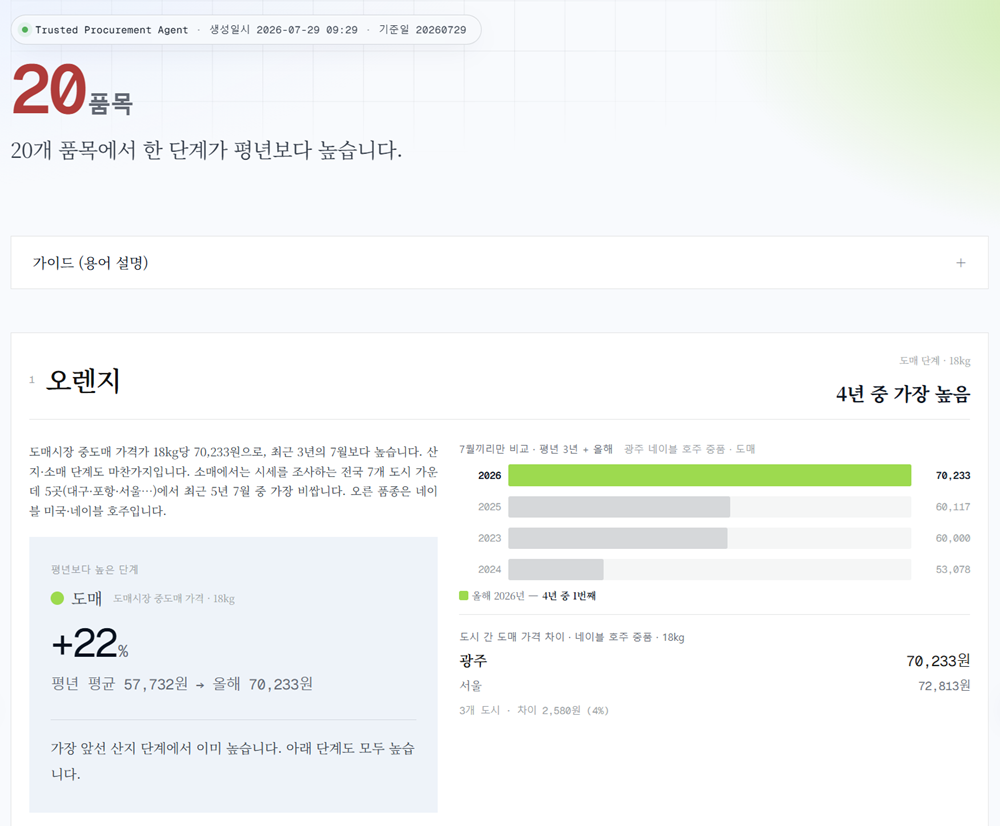
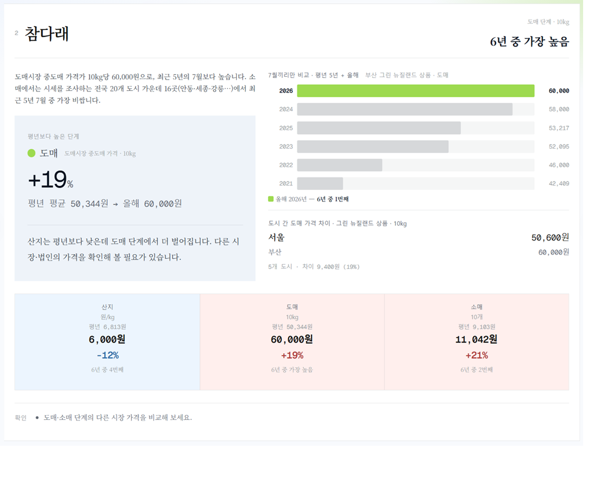
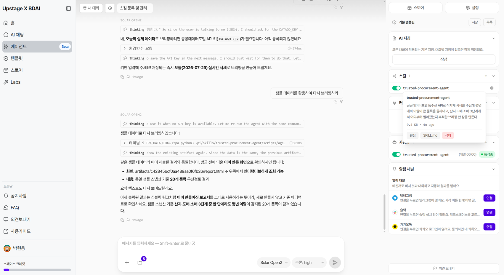

# trusted-procurement-agent

### 식자재 거래에 참고할 정보를 매일 아침에 자동 보고하는 Agent

> 공공데이터로 **산지 · 도매 · 소매** 유통 3단계의 시세를 평년과 비교하여 오늘 먼저 볼 품목만 선별한다.

**사용자** — 기업의 구매·조달 담당자처럼 식자재 거래에 참고할 시세 정보가 필요한 사람
**출품** — 2026 제1회 Upstage × BDAI Harness Engineering Skillthon
**플랫폼** — Timely (`solar-open2`) · 매일 06:00 자동 실행



---

인증키가 없어도 전 과정이 돈다. `sample-data/`에 수집 스냅샷이 들어 있다.

```bash
git clone https://github.com/GongZen/trusted-procurement-agent.git
cd trusted-procurement-agent/skills/data-analysis
python scripts/agent.py
```

끝나면 `output/report.html`이 위 화면이다. 주 실행 경로는 파이썬 표준 라이브러리만 쓴다. 첫 실행은 61종을 전부 판정하느라 3분 남짓(실측 164.8초) 걸리고, 두 번째부터는 자료가 같으면 4.7초에 끝난다.

```bash
python tests/test_loop.py         # 루프가 죽지 않는지 — 16/16
python tests/test_judgment.py     # 판정이 정직한지 — 18/18
python scripts/agent.py --loop 3  # 3회 연속 — 2·3회차는 자료가 같아 건너뛴다
```

실제 시세를 반영하기 위해서는 [공공데이터포털](https://www.data.go.kr/) 키를 넣으면 된다.

```bash
export DATAGO_KEY="발급받은키"
```

---

## 1. 활용하는 데이터의 한계

조달 결정에는 **계약가격 · 구매량 · 재고 · 사용속도** 같은 내부 정보와 **품질규격 · 납기실적** 같은 공급자 정보가 모두 필요하다. 그러나 공공데이터에는 **외부 정보밖에 없다.**

그러므로 공공데이터를 분석하고 과거와 다른 추세를 보고하는 Agent를 만들었다. 활용할 수 있는 데이터의 한계다.

### 답하지 않는 것

| 질문 | 왜 |
|---|---|
| *"앞으로 오를까 내릴까"* | 선행성을 측정하지 않았다 ([DATA_CRITERIA §6](DATA_CRITERIA.md)) |
| *"적정가는 얼마인가"* | 규범적 기준이 없다. **분포상 위치**만 알려준다. |
| *"이 품목을 계속 취급할까"* | 내부 수익성 데이터가 필요하다 |
| *"이 공급처가 믿을 만한가"* | 품질규격·납기실적 데이터가 없다 |

---

## 2. 비교 방식

임의로 임계치를 정하지 않고, 같은 품목·같은 달의 과거 데이터와 비교하여 올해가 몇 번째인지 센다.

```
7월끼리만 비교 · 평년 5년 + 올해
  2026  ████████████████████  60,000원   ← 6년 중 1번째
  2024  ███████████████       58,000원
  2025  █████████████         53,217원
  2023  █████████████         52,095원
  2022  ██████████            46,000원
  2021  ████████              42,409원
```

계절의 영향성을 고려하여 같은 달끼리만 비교한다.

### 카드 정보



| 순서 | 내용 |
|---:|---|
| 1 | 왜 선별되었는지 — 어느 단계가 평년보다 높은지 먼저 알린다 |
| 2 | 선별된 단계의 6년 — 같은 달끼리 비교한 순위 |
| 3 | 세 단계 흐름 — 산지 → 도매 → 소매, 각자의 평년 대비 |
| 4 | 도시 간 도매 가격 차이 — 같은 품종·등급 안에서만 |
| 5 | 확인해 보실 것 · 우리가 모르는 것 |

---

## 3. 유통 3단계를 관통한다

```
산지공판장  ──①──  도매시장  ──②──  소매
  157곳             가락·엄궁 등 11곳    24개 조사 도시
```

| 구간 | 결합 | 상태 |
|---|---|---|
| ① 산지 ↔ 도매 | 품목 코드가 같아 매핑 용이 | 실측 결과, 대분류 8개 일치, 불일치 0 |
| ② 도매 ↔ 소매 | 코드 체계가 달라 별도의 대응표 마련 | **61종 대응 완료** (나머지 30종은 2단계까지) |

각 단계는 자기 평년하고만 비교한다. 관측 단위가 달라(원/kg · 10kg · 10개) 서로 빼거나 나누지 않는다.

### 유통 3단계로 분석한 결과

```
참다래  도매에서 6년 중 가장 높음 (+19%)
   산지 −12% · 도매 +19% · 소매 +21%
   → 산지는 평년보다 낮은데 도매에서 벌어졌다
      다른 시장·법인의 가격을 확인해 볼 필요가 있다

오렌지  도매에서 4년 중 가장 높음 (+22%)
   산지 +40% · 도매 +22% · 소매 +31%
   → 가장 앞선 산지 단계에서 이미 높다
```

같은 「도매 상승」이라도 어느 단계에서 차이가 발생했는지가 다르고, 그래서 확인할 지점이 다르다.

---

## 4. 사람이 없어도 도는 Agent



| 단계 | 주체 | 하는 일 |
|---:|---|---|
| 1 | Agent | 감지 — 오늘 시세 데이터를 확인한다 |
| 2 | Skill | 수집 — 산지·도매·소매를 16개씩 병렬로 가져온다 |
| 3 | Skill | 판정 — 같은 달 과거 관측 중 몇 번째인지로 순위를 매긴다 |
| 4 | Agent | 비교 — 어제와의 차이를 문장으로 만든다 |
| 5 | Agent | 기록 — 판정·미완 범위를 남긴다. 다음 주기가 여기서 이어받는다 |

```
$ python scripts/agent.py --loop 3

[12:50:44] 새 자료 처리 · 지문 c17ad7431f0f2b1f · 호출 1
    ↳ 첫 판정입니다. 우선 검토 20개 품목을 올렸습니다.
[12:53:44] 변화 없음 — 건너뜀 · 지문 c17ad7431f0f2b1f · 호출 1
[12:53:44] 변화 없음 — 건너뜀 · 지문 c17ad7431f0f2b1f · 호출 1
```

---

## 5. 데이터

공공데이터포털 **농수산식품기업지원센터(B552845)** 오픈API. 7개 조건으로 검증한 13종 가운데 **4종**을 썼다 — 유통 3단계와 오늘 시세 감지에 필요한 최소 집합이다. 나머지는 지역별·기간별·친환경 같은 보조 소스라 MVP에 넣지 않았다. 후보 전체와 판정 근거는 [DATA_CRITERIA §2](DATA_CRITERIA.md)에 있다.

| 역할 | 엔드포인트 | 무엇 | 범위 | 동봉 스냅샷 |
|---|---|---|---|---|
| **산지** | `originTrialHall/dealings` | 공판장 낙찰가 | **157곳 전부를 매일 조회** — 당일 거래는 45곳 안팎, 거래량 상위 **12곳** 수집 | 346,522행 |
| **도매** | `katSale/trades` | 도매시장 중도매가 | 공영 도매시장 **11곳** (서울가락·부산엄궁 등) | 33,938행 |
| **소매** | `perYearMonth/price` | 소비자 판매가 | 전국 **24개 도시** 매일 조사 (서울·부산·대구·인천·광주·대전·울산·세종 등) | 158,723행 |
| **감지** | `recent/price` | 오늘 시세 | 변화가 있는지만 본다 — 이 호출 1회로 판정을 건너뛸지 정한다 | — |

**품목 61종** — **산지·도매·소매가 모두 이어지는 품목**이다. 산지↔도매는 품목 코드가 같아 91종이 저절로 이어지므로, 도매↔소매 구간이 품목 61종을 결정한다. 나머지 30종은 산지·도매 2단계까지만 데이터가 존재한다.

> **157곳과 45곳은 서로 다른 것을 센 숫자다.** 157은 코드표에 등록된 전국 산지공판장 전체이고, 매일 이 전부를 조회한다. 공판장은 규모가 작아 하루에 거래가 있는 곳이 45곳 안팎이며, 그중 거래량 상위 12곳을 전량 수집한다.

**이용허락범위 제한 없음** · 제3자가 자기 키로 같은 데이터를 받을 수 있다 ([DATA_SOURCES.md](DATA_SOURCES.md)).

---

## 6. 구조

```
skills/data-analysis/
├── skill.md          스킬 정의 (SKILL.md 와 동일 내용)
├── AGENT.md          자동화 정의 — model · schedule · trigger_prompt
├── README.md         개발자용 문서
├── scripts/
│   ├── agent.py        한 주기 전체. 변화가 없으면 여기서 끝난다
│   ├── collect.py      수집 — 원자 쓰기, 부분 수집은 저장하지 않는다
│   ├── run.py          판정 — 주인공 단계 선정
│   ├── analyze.py      순위 판정과 문장 생성
│   ├── render.py       화면 생성 (HTML · TXT)
│   └── api.py          공공데이터포털 클라이언트
├── reference/        품목 코드표 · 공판장 157곳 · 대응표
├── config/           수집 범위 · 기준연수 · 최소관측수
├── templates/        산출물 서식 (폰트 내장)
├── sample-data/      수집 스냅샷 — 키 없이 실행용
└── tests/            루프 16 · 판정 18
```

---

## 7. 설계 원칙

| 원칙 | 이유 |
|---|---|
| **계산은 코드, 설명은 LLM** | LLM이 수치를 지어내지 못하게 한다 |
| **재현성** | 전역 상태 없음 · 보조 정렬키 · `PYTHONHASHSEED` 독립 |
| **검증을 산출물의 일부로** | 결측·미매칭을 숨기지 않는다 |
| **모르는 것은 모른다고 쓴다** | 「미측정」·「원인 미상」을 그대로 표기한다 |
| **부분 수집은 저장하지 않는다** | 반쪽 자료가 온전한 스냅샷 자리를 차지하면 그것으로 판정된다 |

---

## 한계

- **시세가 오를지 내릴지 예측하지 않는다.** 선행성을 측정하지 않았다.
- **계약단가·재고·발주 일정을 모른다.** 계약이 걸려 있으면 시세 변동과 무관할 수 있다.
- **3단계 분석은 61품목에서만 된다.** 대응표에 없는 품목은 산지·도매 2단계까지의 분석만 가능하다.
- **정부 수급조절(비축·방출) 물량을 반영하지 못한다.** API가 없다.
- **수요·소비량 데이터가 없다.** 활용할 수 있는 데이터가 존재하지 않았다.

---

## 문서

| 순서 | 문서 | 답하는 질문 |
|---:|---|---|
| 1 | **이 문서** | 무엇을 만들었나 · 왜 이렇게 정의했나 |
| 2 | [DATA_CRITERIA.md](DATA_CRITERIA.md) | 데이터를 어떻게 골랐나 — 조건 · 실측 · 판정 |
| 3 | [DATA_SOURCES.md](DATA_SOURCES.md) | 어떻게 받나 — 엔드포인트 · 파라미터 · 재현 절차 |
| 4 | [DECISIONS.md](DECISIONS.md) | 되돌리기 어려운 결정과 그 근거 |
| 5 | [COLLABORATION.md](COLLABORATION.md) | 두 AI가 서로 검토하며 일한 방식 |
| 6 | [skills/data-analysis/README.md](skills/data-analysis/README.md) | 스킬 사용법 — 실행 · 설정 · 산출물 |

AI 협업 도구를 위한 지침은 [AGENTS.md](AGENTS.md)에 있다.

---

## 라이선스

코드는 [MIT License](LICENSE). 데이터는 공공데이터포털 농수산식품기업지원센터 오픈API에서 받은 것으로 **이용허락범위 제한이 없으며**, 동봉된 `sample-data/`는 키 없이 실행을 재현하기 위한 수집 스냅샷이다.
