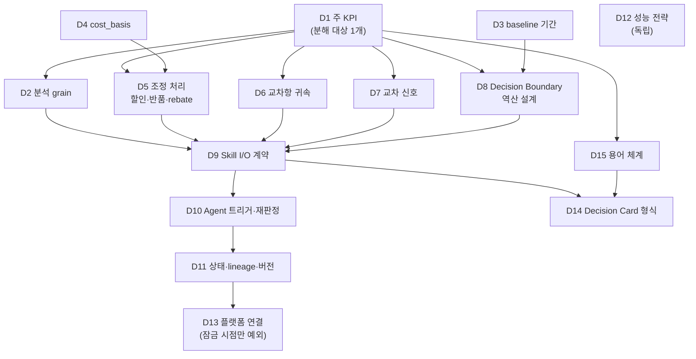

# Scaffolding — 프로젝트 진행 구조

> 작성 2026-07-20 · 개정 2026-07-25 (결정 잠금 구조 신설)
> 목적: **완성물까지 어떤 단계로 도달할지** 정의한다.
> 제품·설계 내용은 [PROJECT_BRIEF.md](PROJECT_BRIEF.md), 협업 절차는 [COLLABORATION.md](COLLABORATION.md).

---

## 이 문서의 원칙

> ### 🔒 구현 중에는 새 결정을 만들지 않는다.
> 결정은 **Step 0에서 잠근다.** 구현 도중 결정이 필요해지면
> 그 자리에서 판단하지 않고 **Step 0으로 돌아가 잠근 뒤 재개**한다.
>
> **예외는 하나뿐이다** — `D13`(플랫폼 연결)은 타임리 사양이 킥오프(7/28) 전까지
> 공개되지 않으므로 그전에 잠글 수 없다. **Step 5b 착수 전**까지 잠근다.

**왜 이 원칙이 필요한가** — 실제 제작 구간은 **7/28 오전 ~ 7/29 14:00, 약 1.5일**이다.
그 시간에 *"이건 어떻게 하지?"*가 나오면 구현이 멈춘다. 결정과 구현을 시간적으로 분리하는 것이
이 프로젝트의 가장 큰 일정 리스크 대응이다.

그래서 각 Step에 **"잠겨 있어야 할 선행 결정"**을 명시했다. 하나라도 비어 있으면 그 Step을 시작하지 않는다.

---

## 0. 완성물

1. **동작하는 Skill**
   - AdventureWorks와 Contoso V2에서 같은 입력·출력 형식으로 동작한다.
   - 두 데이터 변환기가 공통 테스트를 통과한다.
   - 데이터셋별 검증 보고서(`ValidationReport`)를 만든다.
2. **Data Agent**
   - 트리거(새 데이터 또는 일정)를 감지해 Skill을 실행한다.
   - 이전 결과와 비교하고 새 결과를 저장한다.
   - **사람이 없어도 루프가 끊기지 않는다.** 실패는 재시도로 흡수한다.
3. **발표자료 · 포스터**

> 🔴 **제출물의 상세 형식(파일 형태·개수·분량)은 아직 공개되지 않았다.**
> 1차 심사가 *"필수 제출물 여부"*를 기계적으로 스크리닝하므로 **형식 누락은 곧 탈락**이다.
> 사전 교육자료(7/26~27)와 킥오프(7/28) 직후 **최우선으로 확인하고 Step 8을 갱신한다.**

---

## 1. 확정한 결정 (프로젝트 운영)

| # | 결정 | 내용 | 근거 |
|---|---|---|---|
| S1 | 사전 제작 | 공통 분석 코드·테스트·문서는 지금 만든다. 제출 형식에 맞추는 작업은 킥오프 뒤에 한다 | 공지에 사전 제작 제한이 없음 |
| S2 | 기술 구조 | 플랫폼과 분리된 Python 코어를 만들고, JSON·Markdown으로 데이터를 주고받는다. 플랫폼 연결부는 교체 가능하게 얇게 만든다 | 실행 플랫폼이 **타임리**로 지정돼 있으나 세부 사양이 미공개 |
| S3 | 데이터 범위 | Skill 하나를 AdventureWorks와 Contoso V2 **두 곳에만** 적용한다 | [DATA_SOURCES.md](DATA_SOURCES.md) |
| S4 | 진행 순서 | 입출력과 Decision Card의 기본 모양을 먼저 정한 뒤, 최소 기능으로 끝까지 한 번 실행한다. 이후 각 기능을 보강한다 | 연결 오류를 일찍 발견하기 위함 |
| S5 | 결정·구현 분리 | 구현 중 새 결정을 만들지 않는다 (위 원칙) | 실제 제작 구간이 1.5일뿐 |

코드는 네 부분으로 나눈다.

1. **데이터 변환** — 두 데이터셋을 공통 형식으로 바꾼다.
2. **분석** — 검증, 계산, 가설 점수, Decision Card 생성.
3. **LLM 연결** — Solar 호출. **API가 멈춰도 숫자 분석은 완료되어야 한다.**
4. **플랫폼 연결** — 트리거, 일정, 파일 입출력, 비밀키.

데이터 교환용 JSON에는 버전 번호(`schema_version`)를 넣는다.

> **LLM의 역할** — 숫자 계산은 Python으로 고정한다. Solar는 **근거가 있는 가설 비교와 권고 작성**에 사용하되, 출처를 붙이고 **숫자를 새로 만들거나 바꾸지 못하게** 막는다.

---

## 2. 🔒 Step 0 — 잠가야 할 결정 목록

**이것이 이 문서의 핵심이다.** 각 결정은 `DECISIONS.md`에 근거와 함께 기록한다.

### 🔑 착수 조건은 "전부"가 아니라 "그 Step에 필요한 것"이다

> **각 Step은 자기 선행 결정이 잠긴 뒤에 시작한다. 15개를 다 잠글 필요는 없다.**

15개를 전부 앞에 몰아넣으면 S4(*최소 기능으로 끝까지 한 번 실행한 뒤 보강한다*)와 충돌하고, 실제로 이틀 안에 끝나지도 않는다. D7은 holdout 검증이, D8은 수식 설계가 필요하다.

| 언제까지 | 결정 | 왜 그때인가 |
|---|---|---|
| **7/27까지** | **D1~D9 · D15** (10개) | Step 1~4(Skill 완성)를 완주하는 데 필요한 전부 |
| 해당 Step 착수 전 | D10 · D11 (Step 5a) · D14 (Step 6) · D12 (Step 7) | Step 5 이후에만 쓰인다. 앞당길 이유가 없다 |
| **예외** | **D13** (플랫폼 연결) | 킥오프(7/28) 직후 · **Step 5b 착수 전**. 타임리 사양이 그전까지 공개되지 않는다 |

각 Step의 정확한 선행 결정은 §3 표의 **🔒 선행 결정** 열에 있다. **그 열이 착수 조건의 정본이다.**

D13 때문에 **Step 5를 5a(플랫폼 비의존)와 5b(플랫폼 연결)로 나눈다**(§3).
**D13이 늦게 정해져도 Step 1~5a의 코어가 흔들리지 않아야 한다.**

### 2.1 결정 의존 관계



**뿌리는 세 개다 — D1 · D3 · D4.** 이 셋은 서로 독립이라 병행해서 정할 수 있다.

> **그중 D1(주 KPI)에 가장 많은 결정이 매달려 있다.** 이것이 안 정해지면 분해식도, 경계 역산도, 교차 신호의 단위 정합도 정할 수 없다. **그래서 D1을 가장 먼저 잠근다.**
>
> **D12(성능)만 다른 결정에 의존하지 않는 독립 결정이다.** 본체와 함께 7/27까지 잠근다(쓰이는 곳은 Step 7이지만 앞당겨 잠근다).
>
> **D13(플랫폼 연결)은 독립이 아니다 — D10·D11 뒤에 온다.** D13의 확정 조건이 *"Step 5a의 코어를 수정하지 않고 연결 가능함"*의 확인이고, 그 코어는 **D10과 D11이 모두 잠겨야** 만들어지기 때문이다(§3). 그래서 그래프에서 D13은 D11 다음이다. **D13이 예외인 것은 의존 관계가 아니라 잠금 시점**이다(킥오프 이후에만 확정 가능).

### 2.2 결정 카드

| # | 결정 | 정해야 하는 것 | 확정 조건 (무엇이 있어야 잠기는가) | 영향 범위 |
|---|---|---|---|---|
| **D1** | **주 KPI** | `Gross Profit` / `Gross Margin Rate` / `단위당 GP` 중 **분해 대상 1개**. 보조 지표(실현가격 등) 포함 여부는 별도 | 두 데이터 실측 근거 + 가설 개수 영향 + 설명 가능성 판정 | Step 2·3·5 전부 |
| **D2** | 분석 grain | 제품 / 카테고리 / 매장·채널 / 기간 단위 | 두 데이터에서 동일하게 성립하는 grain인지 확인 | Step 1·2 |
| **D3** | baseline 기간 | 비교 기준 기간과 대상 기간 | **look-ahead 차단** — 기준시점 이후 데이터가 섞이지 않음을 확인 | Step 2·D8 |
| **D4** | `cost_basis` | 어떤 원가를 쓸 것인가 (AW 표준원가 ↔ Contoso 거래원가) | 두 데이터의 의미 차이를 메타데이터로 표기하는 방식 확정 | Step 1·2 |
| **D5** | 조정 처리 | 할인·반품·rebate를 분해식에서 어떻게 다루나 | 양쪽 데이터에서 실제 계산 가능한지 확인 | Step 2 |
| **D6** | 교차항 귀속 | 가격×수량 등 교차항을 어디에 붙이나 (Shapley vs 고정 규칙) | **분해 순서에 결과가 의존하지 않음**을 확인 | Step 2 |
| **D7** | 교차 신호 | 어떤 신호 1개를 쓰나 | holdout 검증 통과 + 마진 분해와 비중복 + **설명 가능성** | Step 3 |
| **D8** | Decision Boundary | 역산 수식, 고정 변수, headroom 정의, 근소차 안정화 | 임의 임계치가 **하나도 없음** | Step 3 |
| **D9** | Skill I/O 계약 | `DecisionRequest` → `DecisionCard` 필드 명세, `schema_version` | 두 데이터가 같은 필드를 산출함 | Step 4 · 6 |
| **D10** | Agent 동작 | 트리거 조건, 재판정 규칙, 실패 재시도, **승인 표시 방식** | **사람 없이 루프가 끊기지 않음** (§4 참조) | Step 5a |
| **D11** | 상태·lineage | 이전 결과 저장 형식, 증거 추적 방식, 상태 버전 | 같은 입력에 같은 결과 | Step 5a |
| **D12** | 성능 전략 | 대용량 표본 처리 (Contoso 234만 행) | 실행시간 목표치를 수치로 설정 | Step 7 |
| **D13** | 플랫폼 연결 | 타임리 트리거·스케줄 사용 방식 | ① 타임리가 지원하는 트리거 종류와 스케줄 최소 주기를 킥오프 자료에서 확인 ② 그중 무엇을 쓸지와 그 이유를 기록 ③ **Step 5a의 코어를 수정하지 않고 연결 가능함을 확인** | Step 5b · 8 |
| **D14** | Decision Card 형식 | 한 장에 담을 필수 항목과 배치 (결론·근거·반대증거·경계·미확인·승인 필요 표시) | 공개 출처가 있는 문서 형식을 근거로 삼고, D9의 산출 필드로 **전부 채울 수 있음**을 확인 | Step 6 |
| **D15** | **용어 체계** | 분해 항목의 **표시 용어**(한국어)와 **코드 식별자**(영어) 대응 | ① 관리회계 표준 정의와 **다른 점을 명시**(기준 = 예산이 아닌 **전기 실적**, 대상 = 공헌이익이 아닌 **매출총이익**) ② 코드·표시 분리 대응표 작성 ③ 데이터가 뒷받침하지 못하는 용어를 쓰지 않음 | Step 2 · 6 |

> **D13의 확정 조건은 "킥오프 이후"라는 시점이 아니라 위 3가지 확인 항목이다.**
> 예외 결정에도 검증 가능한 잠금 기준이 있어야 한다.

#### D15 — 용어 대응표 초안 (D15에서 확정)

국내 기업을 대상으로 하므로 **관리회계 용어로 통일**한다. 우리가 하는 것은 관리회계의 **매출차이분석(Sales Variance Analysis)** 체계와 사실상 같다.

```
매출총차이 = 매출가격차이(Price) + 매출조업도차이(Volume)
                                   └→ 매출배합차이(Mix) + 매출수량차이(Quantity)
```

| 코드 식별자 | 표시 용어 | 표준 정의와 다른 점 |
|---|---|---|
| `price_variance` | **매출가격차이** | 기준이 예산 → **전기 실적** |
| `quantity_variance` | **매출수량차이** | 동일 |
| `mix_variance` | **매출배합차이** | 기준 차이 + **공헌이익 → 매출총이익** |
| `unit_cost_change` | **단위원가 변동** | 🔴 ***"원가차이"라고 쓰지 않는다.*** 관리회계의 원가차이는 **표준원가 대비 실제원가**(가격차이·능률차이)를 뜻하며, 우리가 계산하는 **전기 대비 당기 단위원가 변동**과는 다른 개념이다 |
| `discount_effect` | **매출할인 효과** | — |

**산출물에 반드시 함께 표기할 문장**

> 본 분석은 관리회계의 매출차이분석 체계를 따르되, **기준은 예산이 아닌 전기 실적**이고 **공헌이익이 아닌 매출총이익**을 대상으로 한다. 공개 데이터에 예산과 변동비 구분이 없기 때문이다.

이 표기가 없으면 *"예산 기준인가?"*, *"표준원가는 어디서 왔나?"*라는 오해를 부른다. **용어를 빌리면서 기준이 다른 것을 밝히지 않는 것은 데이터가 뒷받침하지 못하는 용어를 쓰는 것과 같다.**

**Step 0 산출물** — 분석 사양서 + `DECISIONS.md` 기록. 결정 하나가 잠길 때마다 추가한다.
**Step 0 통과 기준** — **다음 Step에 필요한 선행 결정**에 빈칸이 없고, 각 항목에 근거와 출처가 있음

---

## 3. 단계 구성

각 Step은 **선행 결정이 잠긴 뒤에만** 시작한다.

| Step | 해야 할 일 | 🔒 선행 결정 | 산출물 | 통과 기준 |
|---|---|---|---|---|
| **0. 결정 잠금** | §2의 결정을 확정한다. **7/27까지 D1~D9·D15** | — | 분석 사양서 · `DECISIONS.md` | 빈칸 없음, 각 결정에 근거 있음 |
| **1. 데이터 준비** | 두 데이터 변환기와 공통 검사를 만든다 | D2 · D4 | 분석 테이블 · `ValidationReport` 2개 | 두 변환기가 공통 테스트 통과, 모든 누락·불일치가 보고됨 |
| **2. 숫자 분석** | 마진 변동을 매출가격차이·매출수량차이·매출배합차이·단위원가 변동·조정으로 나눈다 | D1 · D3 · D5 · D6 · **D15** | 마진 분해 모듈 | 같은 입력 = 같은 결과. **원인별 합계와 전체 변동액의 차이가 허용 오차 안** |
| **3. 판단 층** | 가설 점수 + Decision Boundary + 교차 신호를 붙인다 | D7 · D8 | `HypothesisScore` · 경계 산출 | 계산법이 기록됨. **임의 임계치가 하나도 없음.** 같은 입력 = 같은 점수·미확인 항목 |
| **4. Skill 완성** | Step 1~3을 한 번의 명령으로 실행해 Decision Card를 만든다 | D9 | Skill · I/O 문서 · 예시 · 테스트 | 두 데이터셋이 같은 출력 형식. **모든 숫자에 근거 번호(EvidenceID)** |
| **5a. Agent 코어** | 트리거 감지 → Skill 실행 → 이전 결과 비교 → 저장 → 알림 루프를 만든다. **플랫폼에 의존하지 않는 부분** (로컬 스케줄·파일 감지로 검증) | D10 · D11 | 반복 실행 루프 · 상태 저장 | §4 참조 — **사람 개입 없이 루프 완주** |
| **5b. 플랫폼 연결** | 5a의 루프를 타임리 트리거·스케줄에 연결한다 | **D13** | 플랫폼에서 동작하는 Agent | 플랫폼 위에서도 5a의 통과 기준이 그대로 성립 |
| **6. 비즈니스 문서** | Decision Card를 1페이지 문서로 바꾼다 | D9 · **D14** · **D15** | CEO Decision Card · 브리핑 | 한 페이지 · D14가 정한 필수 항목 전부 충족 |
| **7. 전체 테스트** | 두 데이터셋, 새 환경, 반복 실행, 재시작, 잘못된 입력, API 오류, 실행시간 | D12 | 테스트 결과 | 전 항목 통과. **LLM 오류 시에도 숫자 결과가 남음** |
| **8. 제출 포장** | 제출 형식 적용, 발표자료·포스터, 발표 연습, README 실행 확인 | D13 · **제출 형식 확인** | 제출물 | 제출 조건 전부 충족, 리허설 1회 이상 |

**첫 번째 전체 실행의 목표**

> 같은 요청을 두 공개 데이터에 입력 → 검증 보고서와 간단한 Decision Card 생성
> → Agent가 새 정보를 감지해 각각 한 번 다시 판단

근거: Skill(25%) + Agent(25%) = 배점의 절반. 두 기능의 **연결**을 먼저 검증해야 한다.

---

## 4. 🔴 Step 5a — "사람 개입 없이 반복 동작"을 어떻게 만족시키나

**문제** — 평가 기준은 *"인간 개입 없이 안정적으로 반복 동작하는가"*(Agent 25%)다.
그런데 우리 설계에는 *"승인이 필요한 사안은 자동 확정하지 않는다"*(HITL)가 있다.
**심사자가 이를 "사람이 있어야 도는 Agent"로 읽으면 배점의 25%가 위험해진다.**

**해결 방향 — 루프와 판정을 분리한다.**

| 구분 | 설계 |
|---|---|
| **실행 루프** | **완전 자동.** 트리거 감지 → Skill 실행 → 이전 결과 비교 → 저장 → 알림까지 사람 없이 완주한다. 어떤 경우에도 사람을 기다리며 멈추지 않는다 |
| **HITL** | **멈춤 장치가 아니라 산출물 안의 표시.** Decision Card에 `승인 필요` 플래그와 사유를 넣는다. Agent는 그것을 표시하고 계속 돈다 |
| **실패 처리** | 재시도 → 그래도 실패하면 실패 사실을 기록하고 다음 주기로 넘어간다. 사람 대기 상태로 멈추지 않는다 |

> **한 문장으로:** *"Agent는 사람이 없어도 계속 돈다. 다만 사람이 결정해야 할 것을 표시한다."*
> 이렇게 하면 자동화 요건과 신뢰 요건이 충돌하지 않는다.

**Step 5a 통과 기준**

- [ ] 사람이 한 번도 개입하지 않은 상태로 **연속 3회 이상 트리거 → 산출 완주**
- [ ] 같은 데이터를 다시 줘도 **중복 처리하지 않음**
- [ ] 새 데이터에는 **이전 결과와의 차이(재판정 사유)**가 산출물에 남음
- [ ] 실행 중 오류가 나도 **루프가 죽지 않음** (재시도 후 기록하고 계속)
- [ ] 승인이 필요한 사안은 **자동 확정하지 않되, 루프를 멈추지도 않음** (플래그로 표시)

**Step 5b 통과 기준** — 타임리에 얹은 뒤에도 위 5개가 **그대로 성립**할 것.
5a를 플랫폼 없이 먼저 검증하는 이유가 이것이다. 5b에서 실패하면 원인이 연결부에만 있음을 알 수 있다.

---

## 5. 실전 구간 운영 (7/28 오전 ~ 7/29 14:00)

이 1.5일이 실제 제작 구간이다. **여기서 새 결정을 만들지 않는다 — D13 잠금 하나만 예외다.**
D13은 킥오프 자료를 봐야 정할 수 있으므로 당일에 잠근다. 그 외의 결정은 모두 7/27까지 끝나 있어야 한다.

| 시점 | 하는 일 |
|---|---|
| ~7/27 | **Step 0(D1~D9·D15 잠금) → Step 1 → 2 → 3 → 4**까지 끝낸다. 여유가 있으면 5a(D10·D11 잠금 후) |
| 7/26~27 (교육자료) | **제출물 형식 확인** → Step 8 갱신. D13 사전 조사 |
| 7/28 킥오프 직후 | 형식 최종 확인 → **D13 잠금** → Step 8 체크리스트 확정 |
| 7/28 ~ 7/29 오전 | **Step 5b**(타임리 연결) → Step 6 → 7 |
| 7/29 오전 | 발표자료·포스터 마무리 (Step 8) |
| **7/29 14:00** | 제출 |

**사전에 끝내둘 것 (7/27까지)** — Step 0 ~ 5a. **D13 없이 완주 가능한 범위 전부.**
**당일에만 할 수 있는 것** — Step 5b(타임리 연결), 제출 형식 적용, 발표 준비.

> 이 구분이 무너지면 1.5일 안에 완성할 수 없다.

---

## 6. 실패하면 돌아갈 단계

| 발견한 문제 | 돌아갈 단계 |
|---|---|
| **구현 중에 새 결정이 필요해짐** | **Step 0** (잠그고 재개) |
| 미정 사항이 남거나 정의가 계속 바뀜 | Step 0 |
| 데이터 변환 공통 테스트 실패, 출처·누락 보고 부족 | Step 1 |
| 원인별 합계와 전체 변동액이 맞지 않음 | Step 0(D6) 또는 2 |
| 작은 입력 변화에 가설 점수가 이유 없이 크게 바뀜 | Step 0(D8) 또는 3 |
| 숫자의 근거 번호가 빠짐 | Step 2 또는 4 |
| 중복 실행, 재시작 실패, 루프가 사람을 기다리며 멈춤 | Step 5a |
| 플랫폼에 얹은 뒤에만 실패함 | Step 5b (코어는 건드리지 않는다) |
| 한 페이지 초과, 필수 항목 누락 | Step 0(D14) 또는 6 |
| 새 환경 실행·오류 복구·실행시간 테스트 실패 | 실패 원인이 생긴 Step |
| README 실행 실패, 제출 형식·링크 누락 | Step 8 |

각 Step에 실제 확인 명령과 기대 결과를 기록한다. 근거: 평가 기준이 **재현성과 사람 없는 반복 실행**을 본다.

---

## 7. 아직 정하지 않은 사항

**여기에는 "우리가 정할 것"을 두지 않는다.** 우리가 정할 것은 전부 §2의 결정 카드로 번호화한다.
아래는 **외부에서 공개되기를 기다려야 하는 확인 사항**뿐이다.

1. **필수 제출물의 상세 형식** — 교육자료(7/26~27)·킥오프(7/28) 확인 🔴 최우선
2. **타임리 플랫폼의 트리거·스케줄 사양** — 확인 후 D13으로 잠근다
3. 사전 제작 허용 범위의 세부 해석 — 킥오프에서 확인

---

## 8. 작업 관리

- 각 Step은 **GitHub Issue 하나**로 등록하고, 위 "통과 기준"을 Issue의 완료 조건으로 그대로 옮긴다.
- **Step 0의 결정 D1~D15는 각각 별도 Issue**로 만든다. 결정 하나 = Issue 하나 = PR 하나여야 근거가 추적된다.
- 구현은 Issue별 브랜치에서 진행하고 PR로 병합한다. 절차: [COLLABORATION.md](COLLABORATION.md)
